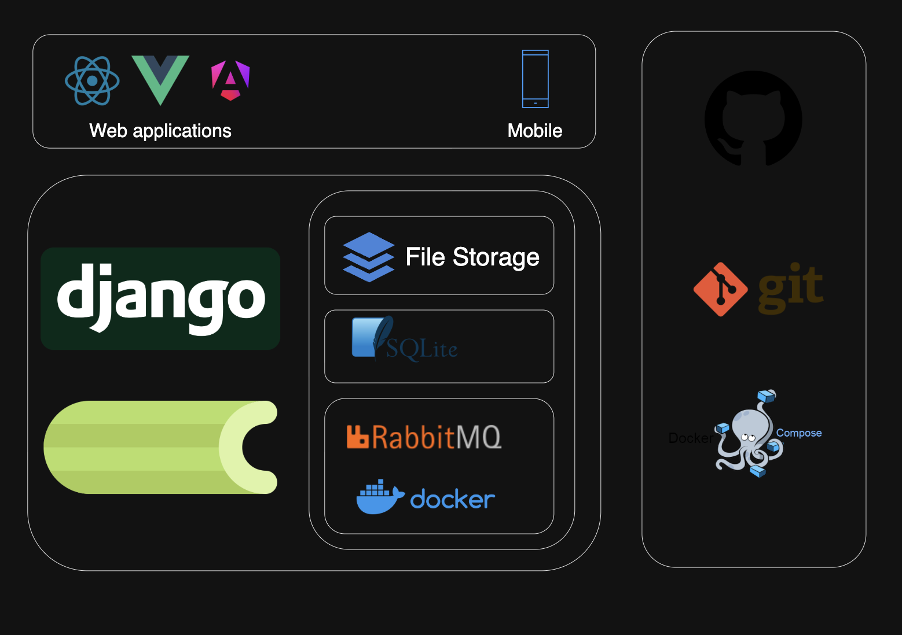
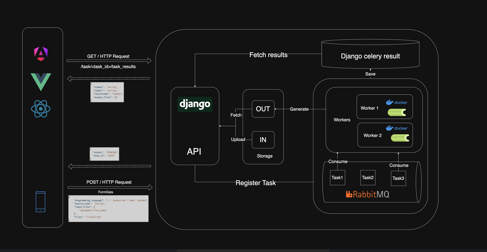

# CodeBox


# Table of Contents
#### - [📖 Project Overview](#-project-overview)
#### - [✨ Core Features](#-core-features)
#### - [💻 Tech Stack](#-tech-stack)
#### - [⚙️ Architecture Overview](#️-architecture-overview)
#### - [📈 API Reference](#-api-reference)
#### - [🚀 Getting Started](#-getting-started)


# 📖 Project Overview:

**CodeBox** is a web service designed for secure online code execution.

It supports multiple programming languages `(python, c, javascript, php)` and runs code inside sandboxed Docker containers, ensuring strong isolation and protection against malicious code.

With CodeBox, you can:

- Safely execute  code in a controlled environment.

- Run snippets in different languages without local setup.

- Upload files, process them with your code (e.g., modify images, generate PDFs, transform data), and download the results through a secure endpoint.


# ✨ Core features:

`Secure Code Execution`: Run code in multiple languages inside isolated Docker containers for maximum safety.

`File Handling`: Upload files as input, process them with your code (e.g., image manipulation, PDF generation), and download the results from a secure endpoint.

`Job Management`: Asynchronous task execution with Celery and RabbitMQ.

`Storage Management`: Automatic handling of input and generated files, with daily cleanup via cron jobs.

`Rate Limiting`: Prevents abuse and ensures fair resource usage.

`Health Checks`: Built-in monitoring to ensure system stability and availability.

`Monitoring`: Task tracking and insights with Flower.

`Deployment Ready`: containerized with Docker and Docker Compose.

`Environment Management`: Separate configurations for development and production.

`CI/CD Pipeline`: Automated build, linting, and testing for reliable delivery.


# 💻 Tech Stack

         




# ⚙️ Architecture Overview:
CodeBox is built around a modular and asynchronous architecture to guarantee security, scalability, and isolation of user code execution.

The system is composed of six main components:

### 1. API Layer (Django REST Framework):
- Validate incoming requests.
- Handle input files (upload, path resolution).
- Manage exceptions and return structured error responses.
- Redirect jobs to the appropriate Celery tasks `run_code()` / `run_code_with_files()`.


### 2. Celery Workers:
Asynchronous task processors that:

- Generate a unique ID for each task.
- Process and validate source code .
- Build the correct Docker run command (e.g., gcc for C, node for Node.js, python for Python).
- Mount code and input files inside the sandbox container.
- Execute code and collect stdout/stderr/results.
- Persist execution results in the results database.
- Save generated files under the output storage path.

### 3. RabbitMQ Broker:
- Queueing submitted tasks.
- Distributing jobs among Celery workers.

### 4. Docker Sandbox:
Isolated execution environment for user code:

- Provides interpreters and compilers.
- Pre-installed with libraries for image/file transformations.
- Configured with strict resource limits and verifications for security and isolation.


### 5. Database Layer (SQLite / PostgreSQL):
- Stores task results, metadata, and execution logs.
- SQLite for development (lightweight, no external dependencies) / PostgreSQL for production (scalable, reliable, concurrent-friendly).

### 6. File Storage:
Organized into two main directories:

- `/storage/in/{taskId}` → contains uploaded input files for each task.
- `/storage/out/{taskId}` → contains generated output files after execution.

This separation ensures traceability and simplifies cleanup.




# 📈 API Reference:

**Base path:** _prefix with your router base (e.g., `/api/`)_


### Code Execution (no files)

| Method | Path                          | Purpose                         | Body (JSON)                                                                 | Success Response                                         | Other Responses                                                                 |
|:-----:|--------------------------------|----------------------------------|-----------------------------------------------------------------------------|----------------------------------------------------------|----------------------------------------------------------------------------------|
| POST  | `/tasks/create`                | Enqueue a code-execution task    | `programming_language` (one of `python` \| `javascript` \| `php` \| `c`), `source_code` (string) | `202 Accepted` → `{ "task_id": "<id>", "status": "accepted" }` | `400 Bad Request` (validation error)                                             |
| GET   | `/tasks/{task_id}/task_result` | Fetch task status or final result| —                                                                           | `200 OK` → `{ "task_id", "status", "result": { "stdout", "stderr", "returncode", "error?", "output_files?" } }` | `202 Accepted` → `{ "state": "PENDING" \| "RECEIVED" \| "STARTED" \| "RETRY" }`<br>`404 Not Found` (no TaskResult) |

**Notes**
- The view normalizes a typo by mapping `sterr` → `stderr` if present.

---

### File-backed Executions (upload → execute → download)

| Method | Path                         | Purpose                               | Body (multipart/form-data)                                                                                             | Success Response                                      | Other Responses                                                                                                          | Notes |
|:-----:|-------------------------------|----------------------------------------|-------------------------------------------------------------------------------------------------------------------------|-------------------------------------------------------|---------------------------------------------------------------------------------------------------------------------------|-------|
| POST  | `/file_task/create`           | Upload files & enqueue execution task  | `programming_language` (string), `source_code` (string), `input_files[]` (array of filenames), `files` (multiple file parts) | `202 Accepted` → `{ "task_id": "<id>", "status": "accepted" }` | `400 Bad Request` (validation error)<br>`500 Internal Server Error` (unexpected)                                          | `files` and `input_files` must match 1:1; max **5** files. |
| GET   | `/file_task/{task_id}/download` | Download produced outputs               | —                                                                                                                       | `200 OK` → **binary** (single file) or **zip** (multiple files) | `202 Accepted` → `{ "state": "PENDING" \| "RECEIVED" \| "STARTED" \| "RETRY" }`<br>`404 Not Found` → `"No output files"` or `"TaskResult does not exist"` | ZIP name via `build_zip_filename(<task_id>)`. |

**Celery States**: `PENDING`, `RECEIVED`, `STARTED`, `RETRY`, `SUCCESS`, `FAILURE`, `REVOKED`.

**Important !**:
CodeBox supports special placeholders that are text-replaced in your source code before execution so you can refer to uploaded inputs and choose output paths without hardcoding absolute paths.

|   Kind | Pattern            | Meaning                                                                                           |
| -----: | ------------------ | ------------------------------------------------------------------------------------------------- |
|  Input | `IN_{N}`           | Absolute path to the **N-th** uploaded file from `input_files` (1-based index).                   |
| Output | `OUT_{NAME}.{EXT}` | Absolute path where your program should **write** a generated file (you choose `NAME` and `EXT`). |

Indexing: IN_1, IN_2, … map to the order in your request’s input_files array.
Case & chars: stick to letters, numbers, _ or - in {NAME}; include a real file extension in {EXT}.

example:
```json

{
  "programming_language": "python",
  "source_code": "...",
  "input_files": ["f1.txt", "f2.png"]
}

```

```python

from pathlib import Path

img_bytes = Path("IN_2").read_bytes()  # "IN_2" → "/storage/in/<task>/f2.png" (abs path)

out_pdf = "OUT_report.pdf"             # → "/storage/out/<task>/report.pdf" (abs path)
# ... generate your PDF to out_pdf ...
# Return the final path(s) in your task result's `output_files`.

```

For more examples, check [docs/examples](docs/examples/).

### Error Reference

| Code | Meaning                 | Typical cause                                        |
|-----:|-------------------------|------------------------------------------------------|
| 400  | Bad Request             | Invalid body, unsupported language, missing fields   |
| 401  | Unauthorized *(if used)*| Missing/invalid auth                                 |
| 403  | Forbidden *(if used)*   | Not allowed for this account                         |
| 404  | Not Found               | Unknown `task_id` or no output files                 |
| 413  | Payload Too Large       | Exceeds max upload size/limit                        |
| 429  | Too Many Requests       | Rate limit exceeded *(if enabled)*                   |
| 500  | Internal Server Error   | Unexpected error                                     |

---

# 🚀 Getting Started:

### 1. Pre-requisite:
- Python 3.10+
- pip
- Docker & Docker Compose v2 (docker compose …)
- make (recommended; otherwise run the underlying commands)

### 2. Clone the Repository

Clone the repository to your local machine:

```bash
git clone git@github.com:Mazene-ZERGUINE/CodeBox.git
cd codeBox
```

### 3. Setup the project environment

Set the env variables: (follow .env.example model)


run the command
```bash
make install
```

This creates a virtual env (.venv/) and installs from requirements.txt

### 4. infrastructure (containers):
```bash
docker compose up -d
```

This brings up RabbitMQ server, and builds the sandbox container for code executions.

### 5. Migrations:
```bash
make migrate
```
this will run the necessary migrations to bootstrap the app (celery_result_backend)

### 6. Start services:

Start Celery first (the API relies on a running broker/worker for task flow):
```bash
make celery
```

Then run the API:
```bash

make dev # For development environment
make prod # For production
```

Production (requires proper ASGI/WSGI server config)


### 7. Monitoring

```bash
make flower
```
Opens Flower to monitor Celery tasks, queues, and results.
